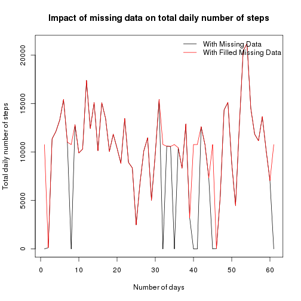

Reproducible Research: Peer Assessment 1
============================================

### Loading and preprocessing the data.

#### 1. Load the data.


```r
activ <- read.csv("activity.csv", header = T)
```


#### 2. Process/transform the data (if necessary) into a format suitable for your analysis.

Convert the class for column: "date" to class:Date

```r
activ$date <- as.Date(activ$date)
```


### What is mean total number of steps taken per day? 
#### For this part of the assignment, you can ignore the missing values in the dataset.

#### 1. Make a histogram of the total number of steps taken each day.

```r
histsumperday <- hist(tapply(activ$steps, activ$date, sum, na.rm = TRUE), main = "Total number of steps taken each day", 
    xlab = "Sum of steps per day")
```

 


#### 2. Calculate and report the mean and median total number of steps taken per day.

Calculate the mean of total number of steps taken per day.

```r
meanperday <- tapply(activ$steps, activ$date, mean, na.rm = TRUE)
meanperdaydf <- as.data.frame(meanperday)
meanperdaydf[1]
```

```
##            meanperday
## 2012-10-01        NaN
## 2012-10-02     0.4375
## 2012-10-03    39.4167
## 2012-10-04    42.0694
## 2012-10-05    46.1597
## 2012-10-06    53.5417
## 2012-10-07    38.2465
## 2012-10-08        NaN
## 2012-10-09    44.4826
## 2012-10-10    34.3750
## 2012-10-11    35.7778
## 2012-10-12    60.3542
## 2012-10-13    43.1458
## 2012-10-14    52.4236
## 2012-10-15    35.2049
## 2012-10-16    52.3750
## 2012-10-17    46.7083
## 2012-10-18    34.9167
## 2012-10-19    41.0729
## 2012-10-20    36.0938
## 2012-10-21    30.6285
## 2012-10-22    46.7361
## 2012-10-23    30.9653
## 2012-10-24    29.0104
## 2012-10-25     8.6528
## 2012-10-26    23.5347
## 2012-10-27    35.1354
## 2012-10-28    39.7847
## 2012-10-29    17.4236
## 2012-10-30    34.0938
## 2012-10-31    53.5208
## 2012-11-01        NaN
## 2012-11-02    36.8056
## 2012-11-03    36.7049
## 2012-11-04        NaN
## 2012-11-05    36.2465
## 2012-11-06    28.9375
## 2012-11-07    44.7326
## 2012-11-08    11.1771
## 2012-11-09        NaN
## 2012-11-10        NaN
## 2012-11-11    43.7778
## 2012-11-12    37.3785
## 2012-11-13    25.4722
## 2012-11-14        NaN
## 2012-11-15     0.1424
## 2012-11-16    18.8924
## 2012-11-17    49.7882
## 2012-11-18    52.4653
## 2012-11-19    30.6979
## 2012-11-20    15.5278
## 2012-11-21    44.3993
## 2012-11-22    70.9271
## 2012-11-23    73.5903
## 2012-11-24    50.2708
## 2012-11-25    41.0903
## 2012-11-26    38.7569
## 2012-11-27    47.3819
## 2012-11-28    35.3576
## 2012-11-29    24.4688
## 2012-11-30        NaN
```


Calculate the median of total number of steps taken per day.

```r
medianperday <- tapply(activ$steps, activ$date, median, na.rm = TRUE)
medianperdaydf <- as.data.frame(medianperday)
medianperdaydf[1]
```

```
##            medianperday
## 2012-10-01           NA
## 2012-10-02            0
## 2012-10-03            0
## 2012-10-04            0
## 2012-10-05            0
## 2012-10-06            0
## 2012-10-07            0
## 2012-10-08           NA
## 2012-10-09            0
## 2012-10-10            0
## 2012-10-11            0
## 2012-10-12            0
## 2012-10-13            0
## 2012-10-14            0
## 2012-10-15            0
## 2012-10-16            0
## 2012-10-17            0
## 2012-10-18            0
## 2012-10-19            0
## 2012-10-20            0
## 2012-10-21            0
## 2012-10-22            0
## 2012-10-23            0
## 2012-10-24            0
## 2012-10-25            0
## 2012-10-26            0
## 2012-10-27            0
## 2012-10-28            0
## 2012-10-29            0
## 2012-10-30            0
## 2012-10-31            0
## 2012-11-01           NA
## 2012-11-02            0
## 2012-11-03            0
## 2012-11-04           NA
## 2012-11-05            0
## 2012-11-06            0
## 2012-11-07            0
## 2012-11-08            0
## 2012-11-09           NA
## 2012-11-10           NA
## 2012-11-11            0
## 2012-11-12            0
## 2012-11-13            0
## 2012-11-14           NA
## 2012-11-15            0
## 2012-11-16            0
## 2012-11-17            0
## 2012-11-18            0
## 2012-11-19            0
## 2012-11-20            0
## 2012-11-21            0
## 2012-11-22            0
## 2012-11-23            0
## 2012-11-24            0
## 2012-11-25            0
## 2012-11-26            0
## 2012-11-27            0
## 2012-11-28            0
## 2012-11-29            0
## 2012-11-30           NA
```


### What is the average daily activity pattern?

#### 1. Make a time series plot (i.e. type = "l") of the 5-minute interval (x-axis) and the average number of steps taken, averaged across all days. (y-axis)

```r
intervals <- split(activ$steps, activ$interval)
scatplotavgsteps <- plot(names(intervals), tapply(activ$steps, activ$interval, 
    mean, na.rm = TRUE), type = "l", xlab = "Intervals", ylab = "Average no. of steps across all days", 
    main = "Intervals Vs Average number of steps across all days")
```

 


#### 2. Which 5-minute interval, on average across all the days in the dataset, contains the maximum number of steps?

```r
avgperint <- tapply(activ$steps, activ$interval, mean, na.rm = TRUE)
which(avgperint == max(tapply(activ$steps, activ$interval, mean, na.rm = TRUE)))
```

```
## 835 
## 104
```

```r
avgperint[which(avgperint == max(tapply(activ$steps, activ$interval, mean, na.rm = TRUE)))]
```

```
##   835 
## 206.2
```

##### Answer: The 5-minute interval: "835" contains on average the maximum number of steps.


### Inputing missing values.
##### Note that there are a number of days/intervals where there are missing values. (coded as NA). The presence of missing days may introduce bias into some calculations or summaries of the data.

#### 1. Calculate and report the total number of missing values in the dataset. (i.e. the total number of rows with NAs)

```r
missnum <- length(which(is.na(activ$steps)))
missnum
```

```
## [1] 2304
```


#### 2. Devise a strategy for filling in all of the missing values in the dataset. The strategy does not need to be sophisticated. For example, you could use the mean/median for that day, or the mean for that 5-minute interval, etc.

##### Answer: Strategy - Fill the missing values for the column: steps (i.e NAs) with the average number of steps taken for that corresponding 5-minute interval averaged across all days.

#### 3. Create a new dataset that is equal to the original dataset but with the missing data filled in.

```r
modactiv <- activ
for (i in 1:length(modactiv$steps)) {
    if (is.na(modactiv$steps[i])) {
        modactiv$steps[i] <- avgperint[which(names(avgperint) == modactiv$interval[i])]
    }
}
```


#### 4.a. Make a histogram of the total number of steps taken each day.

Histogram of total number of steps taken each day. (NAs filled with data)

```r
histsumperdayfill <- hist(tapply(modactiv$steps, modactiv$date, sum, na.rm = TRUE), 
    main = "Total number of steps taken each day", xlab = "Sum of steps per day")
```

 


#### 4.b. Calculate the mean of total number of steps taken per day. (NAs filled with data)

```r
meanperdayfill <- tapply(modactiv$steps, modactiv$date, mean, na.rm = TRUE)
meanperdayfilldf <- as.data.frame(meanperdayfill)
meanperdayfilldf[1]
```

```
##            meanperdayfill
## 2012-10-01        37.3826
## 2012-10-02         0.4375
## 2012-10-03        39.4167
## 2012-10-04        42.0694
## 2012-10-05        46.1597
## 2012-10-06        53.5417
## 2012-10-07        38.2465
## 2012-10-08        37.3826
## 2012-10-09        44.4826
## 2012-10-10        34.3750
## 2012-10-11        35.7778
## 2012-10-12        60.3542
## 2012-10-13        43.1458
## 2012-10-14        52.4236
## 2012-10-15        35.2049
## 2012-10-16        52.3750
## 2012-10-17        46.7083
## 2012-10-18        34.9167
## 2012-10-19        41.0729
## 2012-10-20        36.0938
## 2012-10-21        30.6285
## 2012-10-22        46.7361
## 2012-10-23        30.9653
## 2012-10-24        29.0104
## 2012-10-25         8.6528
## 2012-10-26        23.5347
## 2012-10-27        35.1354
## 2012-10-28        39.7847
## 2012-10-29        17.4236
## 2012-10-30        34.0938
## 2012-10-31        53.5208
## 2012-11-01        37.3826
## 2012-11-02        36.8056
## 2012-11-03        36.7049
## 2012-11-04        37.3826
## 2012-11-05        36.2465
## 2012-11-06        28.9375
## 2012-11-07        44.7326
## 2012-11-08        11.1771
## 2012-11-09        37.3826
## 2012-11-10        37.3826
## 2012-11-11        43.7778
## 2012-11-12        37.3785
## 2012-11-13        25.4722
## 2012-11-14        37.3826
## 2012-11-15         0.1424
## 2012-11-16        18.8924
## 2012-11-17        49.7882
## 2012-11-18        52.4653
## 2012-11-19        30.6979
## 2012-11-20        15.5278
## 2012-11-21        44.3993
## 2012-11-22        70.9271
## 2012-11-23        73.5903
## 2012-11-24        50.2708
## 2012-11-25        41.0903
## 2012-11-26        38.7569
## 2012-11-27        47.3819
## 2012-11-28        35.3576
## 2012-11-29        24.4688
## 2012-11-30        37.3826
```


#### 4.c. Calculate the median of total number of steps taken per day. (NAs filled with data)

```r
medianperdayfill <- tapply(modactiv$steps, modactiv$date, median, na.rm = TRUE)
medianperdayfilldf <- as.data.frame(medianperdayfill)
medianperdayfilldf[1]
```

```
##            medianperdayfill
## 2012-10-01            34.11
## 2012-10-02             0.00
## 2012-10-03             0.00
## 2012-10-04             0.00
## 2012-10-05             0.00
## 2012-10-06             0.00
## 2012-10-07             0.00
## 2012-10-08            34.11
## 2012-10-09             0.00
## 2012-10-10             0.00
## 2012-10-11             0.00
## 2012-10-12             0.00
## 2012-10-13             0.00
## 2012-10-14             0.00
## 2012-10-15             0.00
## 2012-10-16             0.00
## 2012-10-17             0.00
## 2012-10-18             0.00
## 2012-10-19             0.00
## 2012-10-20             0.00
## 2012-10-21             0.00
## 2012-10-22             0.00
## 2012-10-23             0.00
## 2012-10-24             0.00
## 2012-10-25             0.00
## 2012-10-26             0.00
## 2012-10-27             0.00
## 2012-10-28             0.00
## 2012-10-29             0.00
## 2012-10-30             0.00
## 2012-10-31             0.00
## 2012-11-01            34.11
## 2012-11-02             0.00
## 2012-11-03             0.00
## 2012-11-04            34.11
## 2012-11-05             0.00
## 2012-11-06             0.00
## 2012-11-07             0.00
## 2012-11-08             0.00
## 2012-11-09            34.11
## 2012-11-10            34.11
## 2012-11-11             0.00
## 2012-11-12             0.00
## 2012-11-13             0.00
## 2012-11-14            34.11
## 2012-11-15             0.00
## 2012-11-16             0.00
## 2012-11-17             0.00
## 2012-11-18             0.00
## 2012-11-19             0.00
## 2012-11-20             0.00
## 2012-11-21             0.00
## 2012-11-22             0.00
## 2012-11-23             0.00
## 2012-11-24             0.00
## 2012-11-25             0.00
## 2012-11-26             0.00
## 2012-11-27             0.00
## 2012-11-28             0.00
## 2012-11-29             0.00
## 2012-11-30            34.11
```


#### 4.d. Do these values differ from the estimates from the first part of the assignment? 

##### Answer: Yes. The mean & median estimates differ for only the days(8 days) where the steps column data was missing i.e NA. The estimates for rest of the days where there was no missing steps column data remain unchanged.

#### 4.e. What is the impact of inputing missing data on the estimates of the total daily number of steps?

```r
plot(tapply(activ$steps, activ$date, sum, na.rm = TRUE), col = "black", type = "l", 
    xlab = "Number of days", ylab = "Total daily number of steps", main = "Impact of missing data on total daily number of steps")
points(tapply(modactiv$steps, modactiv$date, sum, na.rm = TRUE), type = "l", 
    col = "red")
legend("topright", lty = 1, bty = "n", col = c("black", "red"), legend = c("With Missing Data", 
    "With Filled Missing Data"))
```

 


##### Answer: Total number of steps/day increased for few days. (8 days) These are the 8 days where the steps column data was missing i.e NA. The total number of steps/day for rest of the days where there was no missing steps column data remains unchanged. Please see the plot above.

### Are there differences in activity patterns between weekdays and weekends?
##### For this part the weekdays() function may be of some help here. Use the dataset with the filled-in missing values for this part.

#### 1. Create a new factor variable in the dataset with two levels "weekday" and "weekend" indicating whether a given date is a weekday or weekend day.

```r
modactiv <- cbind(modactiv, daytype = "weekday")
modactiv$daytype <- as.character(modactiv$daytype)
for (i in 1:length(modactiv$daytype)) {
    p <- weekdays(modactiv$date[i])
    if ((all.equal(p, "Saturday") == "TRUE") | (all.equal(p, "Sunday") == "TRUE")) {
        modactiv$daytype[i] <- "weekend"
    }
}
modactiv$daytype <- as.factor(modactiv$daytype)
levels(modactiv$daytype)
```

```
## [1] "weekday" "weekend"
```


#### 2. Make a panel plot containing a time series plot (i.e. type = "l") of the 5-minute interval (x-axis) and the average number of steps taken, averaged across all weekday days or weekend days (y-axis). 
##### See the README file in the GitHub repository to see an example of what this plot should look like using simulated data.

```r
avgperintperdtype <- tapply(modactiv$steps, list(modactiv$interval, modactiv$daytype), 
    mean, na.rm = TRUE)
intervals <- split(modactiv$steps, modactiv$interval)
par(mfrow = c(2, 1))
plot(names(intervals), avgperintperdtype[, 1], type = "l", ylab = "Number of steps", 
    xlab = "Interval", main = "weekday")
plot(names(intervals), avgperintperdtype[, 2], type = "l", ylab = "Number of steps", 
    xlab = "Interval", main = "weekend")
```

 


##### Answer: Yes, there are differences in activity patterns between weekdays and weekends. (as seen from the above plots)
